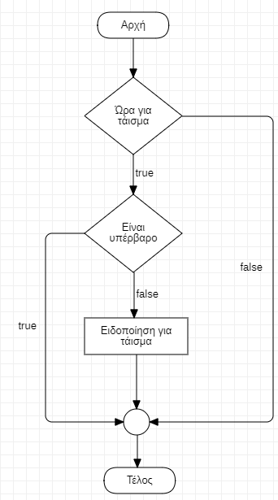
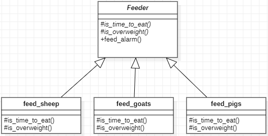

## Τάισμα στο μιτάτο

Στο μιτάτο, επάνω στο βουνό, έχουμε 3 είδη ζώων:
1. **πρόβατα**
2. **κατσίκες**
3. **γουρούνια**

Θα χρειαστεί να αναπτύξουμε ένα λογισμικό που να μας ειδοποιεί εάν κάποιο ζώο θα πρέπει να ταϊστεί.

**Πιο συγκεκριμένα**, εάν για κάποιο ζώο είναι η ώρα για τάισμα και δεν είναι υπέρβαρο, τότε ενεργοποιείται ο συναγερμός εμφανίζοντας στο σύστημα το id του ζώου.

**Επίσης**, ισχύουν τα εξής:
- Τα γουρούνια ταΐζονται πιο συχνά από τα πρόβατα, τα οποία ταΐζονται πιο συχνά από τις κατσίκες.
- Ένα γουρούνι είναι υπέρβαρο εάν έχει ξεπεράσει το 25% του ενδεικτικού βάρους του, ένα πρόβατο εάν έχει ξεπεράσει το 20% του ενδεικτικού βάρους του και μια κατσίκα εάν έχει ξεπεράσει το 15% του ενδεικτικού βάρους της.

## Γενική περιγραφή αλγορίθμου

## Γενική περιγραφή Template Method
Η γενική αρχή της σχεδίασης θα μπορούσε να αποτυπωθεί ως εξής:

